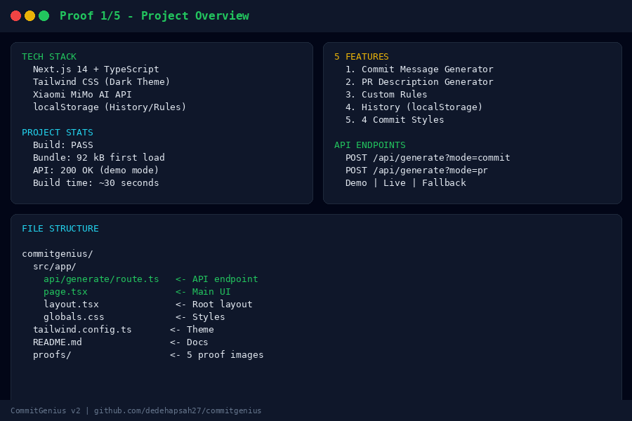
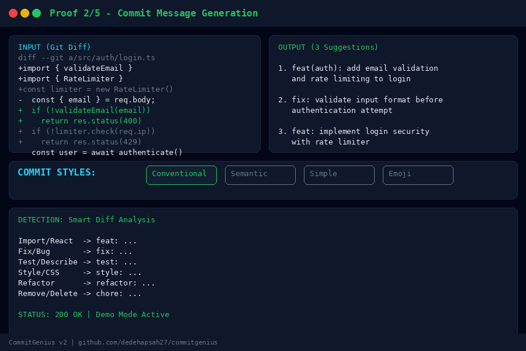
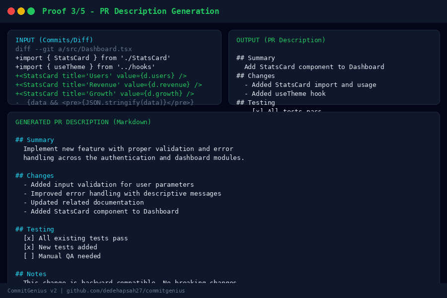
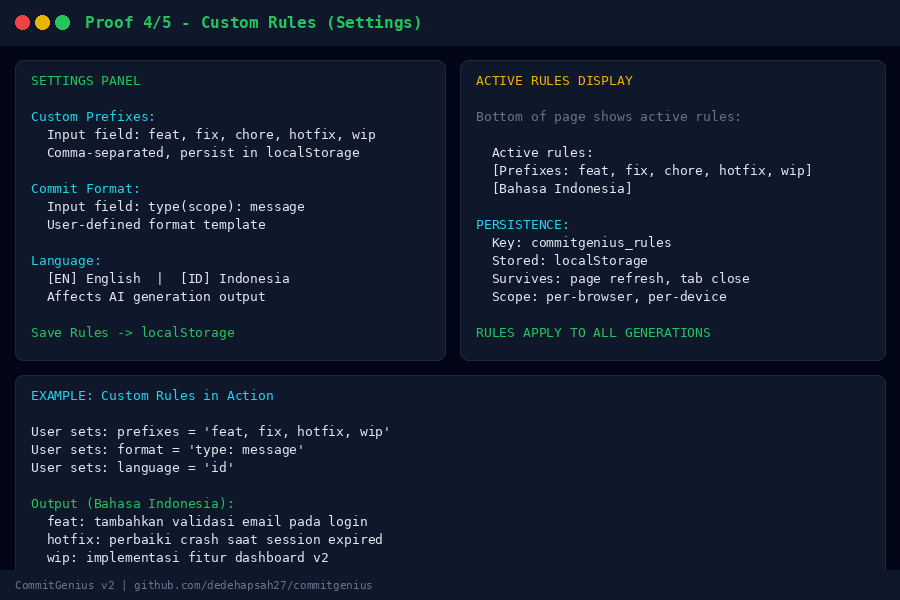
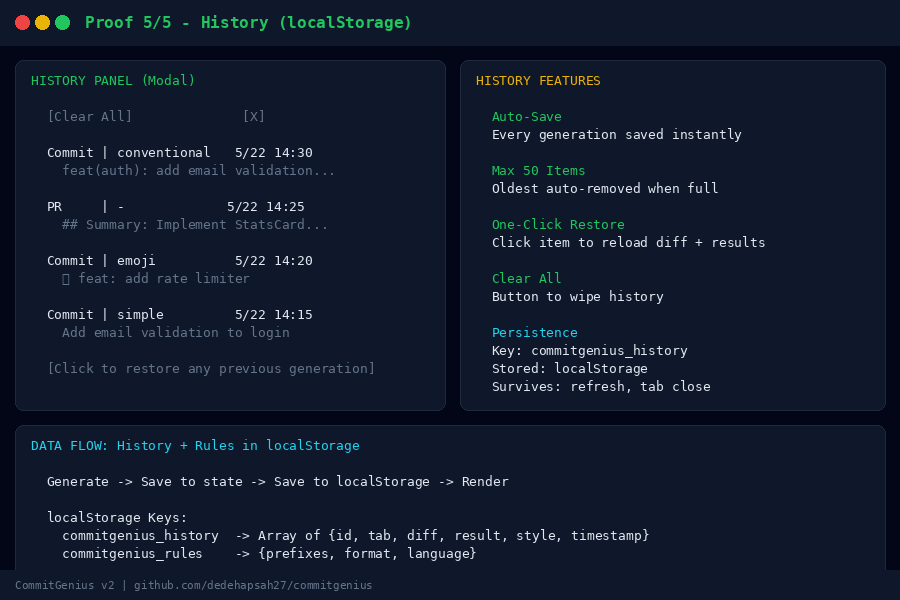

# ⚡ CommitGenius

AI-powered git workflow tool. Generate commit messages AND pull request descriptions from your code diffs.

Built with **Next.js 14**, **TypeScript**, **Tailwind CSS**, and **Xiaomi MiMo AI**.

## ✨ Features

### 📝 Commit Message Generator
- Paste a git diff → get 3 Conventional Commits suggestions
- 4 styles: Conventional, Semantic, Simple, Emoji
- One-click copy

### 🔀 PR Description Generator
- Paste commits or full diff → get a complete PR description
- Includes: Summary, Changes, Testing checklist, Notes
- Copy-ready markdown format

### ⚙️ Custom Rules
- Set your own commit prefixes (feat, fix, hotfix, wip, etc.)
- Choose commit format: `type(scope): message` or `type: message`
- Language: English or Bahasa Indonesia
- Rules persist in localStorage

### 📜 History
- Auto-saves all generated messages
- Click to restore any previous generation
- Max 50 items, stored in localStorage
- Clear history anytime

## 📸 Screenshots

### Project Overview


### Commit Message Generation


### PR Description Generation


### Custom Rules Settings


### History Feature


## 🚀 Quick Start

```bash
npm install
npm run dev
# Open http://localhost:3000
```

## 🔑 API Configuration

**Demo mode (default):** Works out of the box with mock responses.

**Live mode:** Set your MiMo API key:

```bash
echo "MIMO_API_KEY=your_api_key_here" > .env.local
```

Get your API key at [platform.xiaomimimo.com](https://platform.xiaomimimo.com)

## 📦 Tech Stack

- **Frontend:** Next.js 14 (App Router) + TypeScript + Tailwind CSS
- **AI:** Xiaomi MiMo v2.5 (with mock fallback)
- **Storage:** localStorage for history & settings
- **Styling:** Custom dark theme with green accent

## 📁 Project Structure

```
commitgenius/
├── src/app/
│   ├── api/generate/route.ts   # API (commit + PR generation)
│   ├── page.tsx                # Main UI (tabs, history, settings)
│   ├── layout.tsx              # Root layout
│   └── globals.css             # Tailwind + animations
├── tailwind.config.ts
├── README.md
└── package.json
```

## 🎯 How It Works

### Generate Commit Messages
1. Run `git diff` in your terminal
2. Paste the output in CommitGenius
3. Choose a style (Conventional, Semantic, Simple, Emoji)
4. Click **Generate**
5. Click **Copy** on the message you like

### Generate PR Description
1. Switch to **PR Description** tab
2. Paste your commits or full diff
3. Click **Generate**
4. Copy the complete PR description

### Customize Rules
1. Click **⚙️ Rules** in the header
2. Set your preferred prefixes
3. Choose your commit format
4. Select language (EN/ID)
5. Save — rules apply to all future generations

## 📝 Getting a git diff

```bash
# Unstaged changes
git diff

# Staged changes
git diff --staged

# Last commit
git diff HEAD~1

# Specific file
git diff src/auth/login.ts

# Full diff for PR description
git diff main..feature-branch

# Commit log
git log --oneline -10
```

## 📝 License

MIT

---

<div align="center">

**⚡ CommitGenius** — Built with Next.js 14 & Xiaomi MiMo AI

[](https://github.com/dedehapsah27/commitgenius)
[](https://nextjs.org)
[](https://typescriptlang.org)
[](https://tailwindcss.com)
[](https://platform.xiaomimimo.com)

Made with ❤️ for developers who hate writing commit messages

</div>
